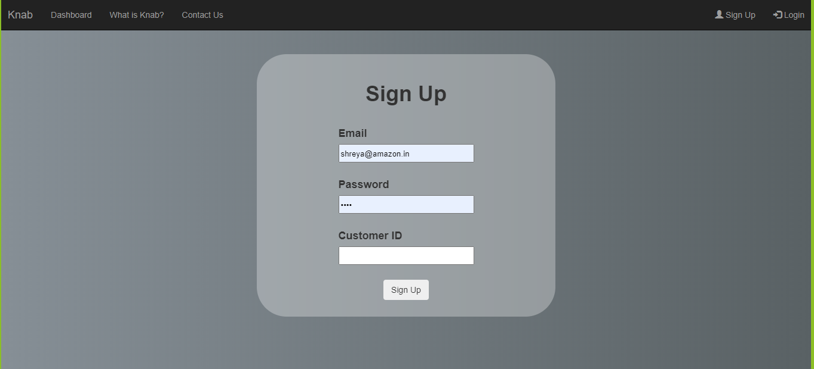
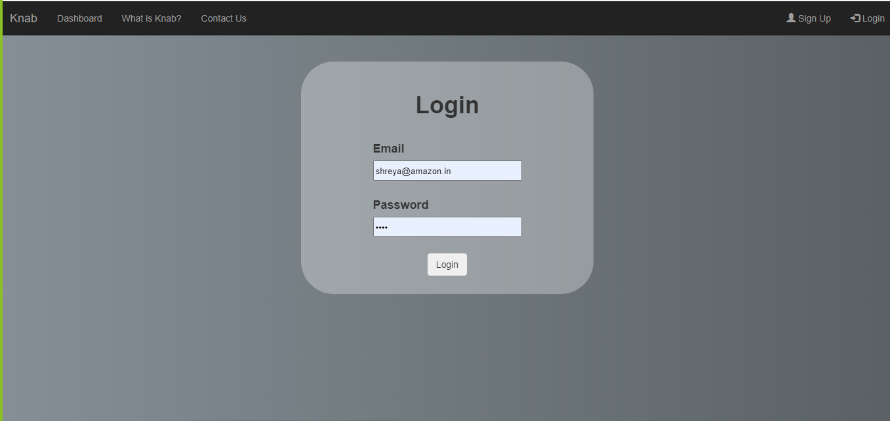
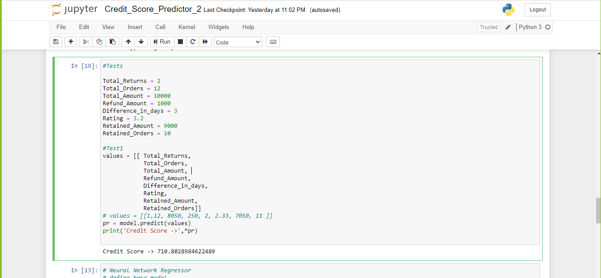

# Loyality and shopping patterns analysis/reward program to reduce customer returns.

Deployed Website link: https://knapapp.herokuapp.com/ (DO READ STEPS MENTIONED BELOW BEFORE VISITING THE SITE)
 
<h3><b>Problem Statement</b></h3>

Ecommerce platform has been witnessing an enormous growth from the past few years and is been predicted to do so further, due to the cut throat competitions between different companies, these companies have come up with various marketing strategies such as 'NO-Question- Asked' return policy, these sort of facilities have proved to be beneficial for many customers, but some of the customers have been exploiting such facilities, which affects the Business Integrity, profits and both the large platforms and small vendors have had to incur losses. This also affects genuine customers who are supportive of these platforms and they should be rewarded with some incentives.
  
On a regular basis, a well-known eCommerce seller receives 20-30% returns of total orders shipped every day. This is quite a common scenario for sellers on other major websites too. But ultimately it is the Sellers and E-commerce companies that take the plunge of losses and customer is not even questioned for their bad shopping patterns.
 

<h3><b>Solution:</b></h3>

Our application(knab app) will reward loyal and honest customers and help sellers by filtering fake and questionable customers. 
Our application took inspiration from CREDIT SCORE system used in banks, which rates a person based on their banking patterns. By using the power of data science and machine learning, our app will analyse customer shopping habits and will reward them accordingly. This Knab Score model will immensely increase the profit margin, which the company would be able to share specifically with its loyal customers. This can have a drastic impact on the online shopping industry especially in India where customers are discovering the power of returning and replacing products without any charges, even if the product was exactly what they asked for.

<h3><b>How to use our App:</b></h3>

1) Visit the above link and go to sign up page.
2) Put your Email, Password and in customer ID enter a random number from 9236000 to 9239999.
3) These are random customer IDs on basis of which you will be alotted a customer with same customer ID that you entered whose knab score will be visible after you login.
4) In future if we collaborate with Ecommerce website customer would not need to enter the customer ID and can register directly from email only.
5) These knab scores are calculated by our ML/Deep learning model that has been implemented on more than 3000 real world customer's data.
6) Your Email and passwords are kept safely in encrypted form so even we as administrator cannot accesss your account.

<h3><b>Screenshots:</b></h3>
 
 
 
 
